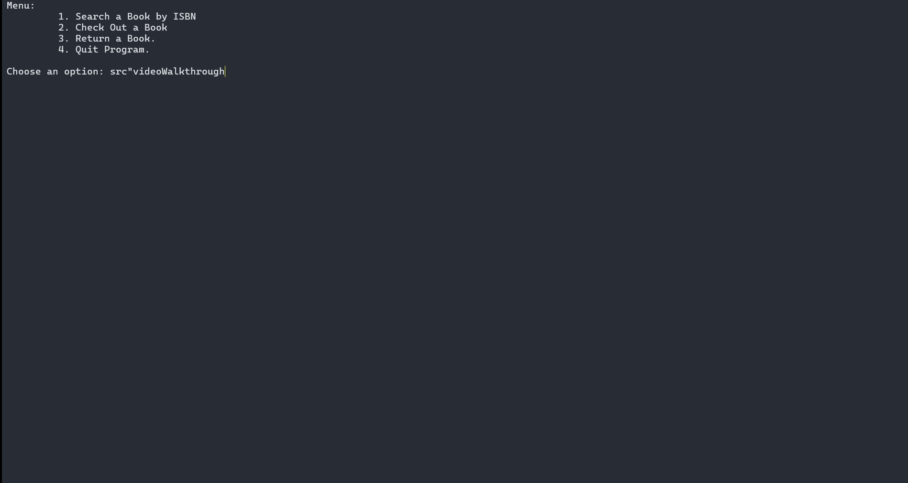

**Library App**

This C++ program is designed to manage a library system by storing information about books, checking them in and out, and ensuring proper book availability. The app handles user interactions efficiently with several core features:

- Preset List of Books: The program initializes with a predefined list of books available in the library.
- ISBN Search: Users can search for books using their ISBN numbers to quickly locate specific titles.
- Book Addition: New books can be added to the system using their ISBN numbers.
- Check-Out System: Books can be checked out by users, with safeguards in place to prevent double check-outs unless previously returned.
- Return System: Books can be returned, but only if they were previously checked out, ensuring accurate tracking of the library's inventory.

